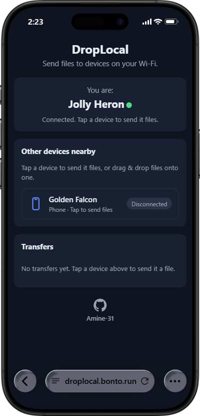
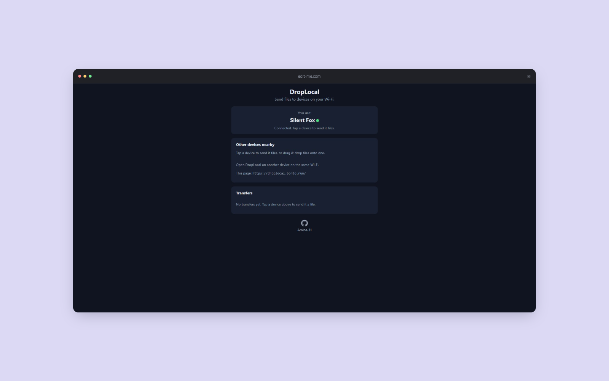

# DropLocal

Send files to devices on your local network, right from the browser — no accounts, no uploads, files fly peer-to-peer over WebRTC.

Live demo: https://droplocal.bonto.run (free hosting: it sleeps after 30 minutes without activity, so the first load can take a while).

## Features

- Nearby device discovery on your network with phone / tablet / computer icons
- Sticky device names (saved in the browser, unique per room)
- Tap a device to send files; drag & drop onto a card or anywhere on the page
- Live progress with percent + speed, accept/decline, cancel, size checks
- Mobile-first UI with dark mode, offline reconnect banner, mid-transfer warnings
- Tiny server: presence + signaling relay only — file bytes never touch it

## Stack

- Node.js + Express (serves `public/`, plus `GET /health` → `ok`)
- `ws` WebSocket server at `/ws` (presence + signaling relay)
- Vanilla HTML/CSS/JS frontend + native `RTCPeerConnection` (no frameworks)
- STUN: `stun:stun.l.google.com:19302`

## Run

```bash
npm install
npm start
```

Open http://localhost:3000 on two browsers/devices on the same network, tap the other device, and pick a file. On desktop you can also drag & drop files straight onto a device card.

Set a custom port with `PORT=4000 npm start`. The server listens on `0.0.0.0`, so LAN devices can reach it directly.

## Testing on a phone

1. Connect the phone and the computer to the **same Wi-Fi**.
2. Start the server on the computer (`npm start` — it listens on all interfaces).
3. Find the computer's LAN address (`ipconfig` on Windows → `IPv4 Address`, e.g. `192.168.1.20`).
4. On the phone's browser open `http://192.168.1.20:3000` (replace with your address).
5. Both devices appear in each other's lists with a phone/computer icon. Tap the other device and send a file. Keep the page in the foreground — mobile browsers may pause background tabs and stall transfers.

## Deploy

Any Node.js host with WebSocket support works:

1. Push this repo to GitHub.
2. Create a web service from the repo with start command `npm start`.
3. The host must set the `PORT` environment variable (the server listens on `process.env.PORT` and `0.0.0.0`).
4. Use the host's HTTPS URL — browsers require a secure context for WebRTC on non-localhost origins, and signaling then runs over `wss://` automatically. WebRTC still connects browsers directly; the server only relays signaling.

The live demo runs on Bonto.

## Limitations

- STUN only, no TURN: transfers need a direct peer-to-peer path. Symmetric NATs or strict firewalls between the devices can prevent connections.
- The receiver keeps incoming files in memory until download — very large files can exhaust a phone's RAM.
- Rooms group by public IP (IPv6 by /64 prefix): a phone on mobile data won't see a laptop on Wi-Fi, even nearby. Use the same network.
- Background mobile browsers may pause the page and stall transfers.

## Screenshots

Phone:



Desktop:



## How presence works

1. Client connects to `/ws?ua=<user-agent>&name=<device-name>`.
2. Server maps the client IP to a room key: private/loopback addresses (`127.0.0.1`, `::1`, `10.x`, `192.168.x`, `172.16–31.x`) all share one room called `local`; any other IPv4 address gets one room per IP; IPv6 addresses group by `/64` prefix (first 4 groups), since devices on the same Wi-Fi get different full addresses from one prefix.
3. Server assigns a random id (`crypto.randomUUID()`). The name is the requested `?name=` when it is valid (1–30 chars of letters/numbers/spaces, not blank) and free in the room; otherwise the session gets a random human-readable name (e.g. `Blue Fox`). The server also stores the UA string (capped at 512 chars, `''` if absent).
4. Server sends the newcomer `{ type: "hello", you }`, then broadcasts `{ type: "devices", devices }` — entries are `{ id, name, ua }` — to everyone in the room on every join/leave. Empty rooms are deleted.

The client persists its name in `localStorage` on first join and offers it on every connect. If the saved name is taken (e.g. by another tab sharing the same storage), the session uses the temporary name but the saved one is left untouched. All names render via `textContent` only, never `innerHTML`.

## How signaling works (server is a blind relay)

- Client sends `{ type: "signal", to: <deviceId>, data: <any> }`.
- Server forwards it **only** to that device and **only** if sender and target share a room, as `{ type: "signal", from: <senderId>, data }`.
- `data` is opaque — the server never reads it. It carries `{ kind: "offer" | "answer", sdp }` or `{ kind: "candidate", candidate }`.
- Anything else (unknown id, other room, closed socket, malformed shape) is silently dropped.

## How WebRTC works (client)

- Tapping a device opens the file picker immediately and connects in parallel if needed (one `RTCPeerConnection`, one `RTCDataChannel` `droplocal` with `binaryType: "arraybuffer"`); files picked while connecting send on channel open. The other side answers automatically.
- ICE candidates trickle through `signal` messages as they arrive.
- Simultaneous taps (glare) resolve deterministically: the smaller device id is polite and accepts the incoming offer; the larger id keeps its own.
- Each card shows a device icon (phone / tablet / computer, guessed from the forwarded User-Agent), the name, and a `Connecting…` / `Connected` / `Disconnected` badge. Tapping again retries a disconnected peer.
- Departed devices have their peer connections closed and removed; a dropped lobby socket closes all peer connections.

## UI notes

- Mobile-first layout (works from 360px up), tap targets ≥ 44px, `viewport-fit=cover` plus `env(safe-area-inset-*)` padding for notched phones, dark mode via `prefers-color-scheme`, inline SVG favicon + `theme-color` metas.
- A visible **Reconnecting…** banner appears while the lobby socket is down (auto-reconnect with backoff continues underneath).
- Leaving/reloading with an active transfer triggers a `beforeunload` warning; idle users get no prompt.
- All actions are real `<button>` elements with labels and a visible `:focus-visible` outline; the lobby status uses `aria-live="polite"`.
- A soft CSS radar ripple plays behind the device list (disabled under `prefers-reduced-motion`).
- Dragging files over the page shows a full-page **Drop files to send** overlay: drop on a card to send to that device, drop elsewhere to send to the only device / pick from a list / see "No devices nearby".

## How file transfer works (client, over the data channel)

Text frames are JSON control messages, binary frames are file bytes:

1. Sender picks files → each gets an id (`crypto.randomUUID()`) and waits in a per-peer outbox queue (**one active file per peer**, so binary frames never interleave).
2. Sender sends `{ type: "file-offer", id, name, size, mime }` → status **Waiting for accept**.
3. Receiver shows `"<device> wants to send <name> (<size>)"` with **Accept** / **Decline**.
4. On `{ type: "file-accept", id }` the sender streams the file with `file.slice()` + `arrayBuffer()` in **16 KiB** chunks → status **Sending**; receiver collects them → status **Receiving**. On `{ type: "file-decline", id }` → status **Declined**.
5. Backpressure: the sender pauses while `channel.bufferedAmount > 1 MB` and resumes on `bufferedamountlow` (`bufferedAmountLowThreshold = 256 KB`).
6. After the last chunk the sender sends `{ type: "file-end", id }`. The receiver checks `received === size`, builds a `Blob`, re-checks `blob.size === size` (otherwise **Failed** with a size-mismatch error), and shows a **Download** link.
7. Either side can abort mid-transfer with the **Cancel** button (`{ type: "file-cancel", id }`) → status **Cancelled** on both ends. A dead connection marks unsettled transfers **Failed**.
8. Receiver sanitizes file names (strips directories, control chars, leading dots; falls back to `file`) for display and the download attribute.

Both sides show a progress bar with percent + speed (B/s, KB/s, MB/s). Full state list: Queued / Waiting for accept / Waiting for your response / Sending / Receiving / Done / Declined / Cancelled / Failed.

## Project layout

```
DropLocal/
  server.js        # Express + ws, /health, rooms, device broadcasts, signal relay
  public/
    index.html     # "You are" + device cards + transfers + hidden file picker
    styles.css     # mobile-first, dark mode, safe-area insets
    client.js      # WS lobby, WebRTC offer/answer/ICE, file transfer engine
  package.json     # `npm start` -> `node server.js`
```

Made by [Amine-31](https://github.com/Amine-31).
